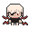

<a id="top"></a>

<div>
  
  
  
  
  <h1 align="center">Anime Maze</h1>
</div>

<p align="center">
  <a href="#">
    
  </a>
  <a href="https://opensource.org/licenses/MIT" target="_blank">
    
  </a>
</p>

<div align="center">
  <a href="#-acerca-del-proyecto" target="_blank">
    Acerca Del Proyecto
  </a>
  <span>&nbsp;✦&nbsp;</span>
      <a href="#-características" target="_blank">
          Características
      </a>
  <span>&nbsp;✦&nbsp;</span>
    <a href="#-arquitectura" target="_blank">
      Arquitectura
    </a>
  <span>&nbsp;✦&nbsp;</span>
    <a href="#-tecnologías" target="_blank">
      Tecnologías
    </a>
  <span>&nbsp;✦&nbsp;</span>
    <a href="#-cómo-empezar" target="_blank">
      Cómo Empezar
    </a>
  <span>&nbsp;✦&nbsp;</span>
    <a href="#-instrucciones-de-juego" target="_blank">
      Instrucciones de Juego
    </a>
  <span>&nbsp;✦&nbsp;</span>
    <a href="#-licencia" target="_blank">
      Licencia
    </a>
</div>
<br>

## 📜 Acerca Del Proyecto
Anime Maze es un juego laberíntico multijugador donde los jugadores controlan héroes de anime para alcanzar la salida del laberinto. 

## 💬 Características:
- Sistema multijugador por turnos
- Personajes con habilidades especiales
- Laberintos generados proceduralmente
- Trampas y obstáculos interactivos
- Sistema de combate estratégico
- Todas las imágenes en pixel art, incluyendo el diseño de los personajes, las paredes, obstáculos, trampas, la flor que es la condición de victoria y otros elementos, fueron creadas por mí.

<p align="right">(<a href="#top" >Volver al inicio 🔝</a>)</p>

## 🏗️ Arquitectura

### Flujo Principal
1. **Inicialización**: Configuración del laberinto y jugadores
2. **Selección de Personajes**: Cada jugador elige su héroe
3. **Generación del Laberinto**: Creación procedural con trampas
4. **Ciclo de Juego**: 
   - Movimiento por turnos
   - Activación de trampas
   - Sistema de combate
5. **Condición de Victoria**: Alcanzar la salida del laberinto

<p align="right">(<a href="#top">Volver al inicio 🔝</a>)</p>

## 🧰 Tecnologías
- [**Blazor .NET 8.0**](https://learn.microsoft.com/es-es/aspnet/core/release-notes/aspnetcore-8.0?view=aspnetcore-9.0): Framework principal para la aplicación web
- [**C#**](https://dotnet.microsoft.com/es-es/languages/csharp): Lógica del juego y algoritmos
- [**Tailwind CSS**](https://tailwindcss.com/): Estilizado de componentes
- [**JavaScript Interop**](https://learn.microsoft.com/en-us/aspnet/core/blazor/javascript-interoperability/?view=aspnetcore-9.0): Integración con APIs del navegador
- [**LibreSprite**](https://libresprite.github.io/#!/):
Para el diseño de los personajes, paredes, obstáculos, trampas, la flor que es la condición de victoria, etc.
<p align="right">(<a href="#top">Volver al inicio 🔝</a>)</p>

## 🚀 Cómo Empezar

### Requisitos
- .NET SDK 8.0 o superior
- Navegador moderno (Chrome 90+, Firefox 88+)

### Instalación
1. Clona el repositorio:
```bash
git clone https://github.com/joserafael0160/Maze-Runners.git
```

2. Restaura dependencias:
```bash
dotnet restore
```

3. Ejecuta el proyecto:
```bash
dotnet watch run
```

4. Abre en tu navegador:
```
http://0.0.0.0:5066
```

<p align="right">(<a href="#top">Volver al inicio 🔝</a>)</p>

## 🎮 Instrucciones de Juego

### Flujo del Juego
1. **Configuración del Laberinto**:
   - Selecciona tamaño del laberinto (9x9 a 35x35)

2. **Selección de Jugadores**
   - Número de jugadores (1-4)
  
3. **Selección de Heroes**:
   - Elige entre héroes de anime con habilidades únicas
   - Cada héroe tiene estadísticas diferentes (vida, ataque, velocidad)

4. **Mecánicas de Juego**:
   - Movimiento por turnos usando teclas (WASD/Flechas)
   - Sistema de combate con ataques básicos y habilidades especiales (Tecla E/F)
   - Interacción con trampas y obstáculos

5. **Estrategia**:
   - Gestiona los movimientos por turno según la velocidad del personaje
   - Usa habilidades especiales en momentos clave
   - Vigila los efectos temporales de las trampas

### Controles
- **Movimiento**: WASD o Flechas direccionales
- **Ataque**: Tecla E
- **Habilidad Especial**: Tecla F

<p align="right">(<a href="#top">Volver al inicio 🔝</a>)</p>

## 🤝 Contribuciones
Las contribuciones son bienvenidas. Sigue estos pasos:
1. Haz un [_fork_](https://github.com/joserafael0160/Maze-Runners/fork) del proyecto
2. Crea una rama para tu feature (`git checkout -b feature/awesome-feature`)
3. Haz commit de tus cambios (`git commit -m 'Add awesome feature'`)
4. Push a la rama (`git push origin feature/awesome-feature`)
5. Abre un [_pull request_](https://github.com/joserafael0160/Maze-Runners/pulls)

<p align="right">(<a href="#top">Volver al inicio 🔝</a>)</p>

## 🔑 Licencia
Distribuido bajo licencia MIT. Ver [LICENSE](https://github.com/joserafael0160/Maze-Runners/blob/main/LICENSE) para más detalles.

<p align="right">(<a href="#top">Volver al inicio 🔝</a>)</p>

## 🙏 Soporte
¿Preguntas o sugerencias? Abre un issue en el repositorio.

No olvides dejar una estrella ⭐️

<p align="right">(<a href="#top">Volver al inicio 🔝</a>)</p>

<br>
<hr>
<p align="center">⚔️ ¡Que la fuerza del anime esté contigo! ⚔️</p>
<sub><sup>Un proyecto creado por <a href="https://github.com/joserafael0160">@joserafael0160</a></sup></sub>